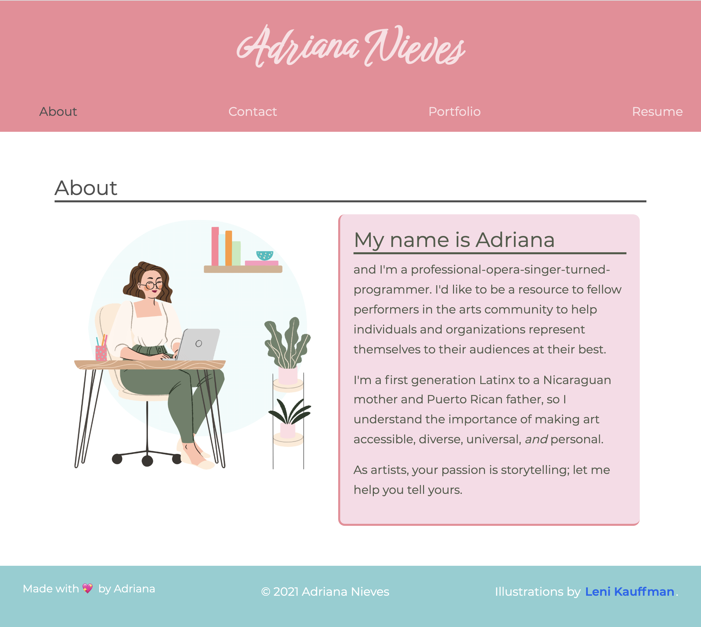

# Adriana's SPA Portfolio

## Description:
This project is a single-page-application (SPA) created with React. It hosts information about myself as a developer, and my web development portfolio.

## Built With the Following:
- JavaScript
 - ES6
 - React
 - JSX
 - React-Bootstrap
 - CSS
 - Node.js

## How To Use:
 1. See the live website here: https://itsmeadriana.github.io/SPA_Portfolio/
 2. Peruse to your heart's content as you learn more about me as a developer.

## Preview:
#### Click the image below to be directed to a live deployment of this portfolio.

## Credits:
 - Illustrations by [Leni Kauffman](https://www.lenikauffman.com)
 - [React-PDF](react-pdf.org) which allowed me to embed my resume
 - "CSS Hover Image Effects" template @ https://codepen.io/nxworld.

## Github:
[https://github.com/itsmeadriana](https://github.com/itsmeadriana)

## License
[Link](https://choosealicense.com/licenses/mit/)

### Made By
© Copyright 2021 Adriana Nieves
